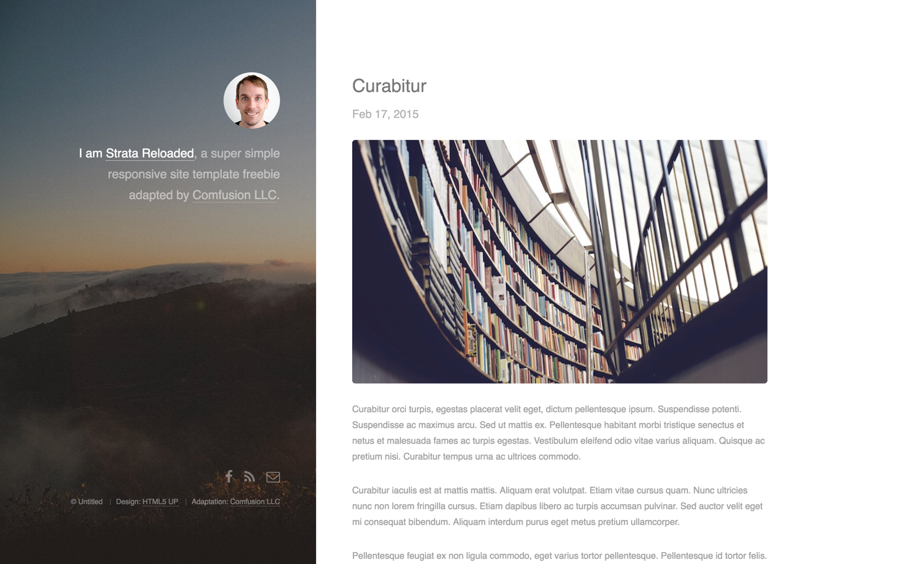

# Strata Reloaded

Simple, clean personal blogging template for Jekyll based on Strata by HTML5 UP.

## Features

* Parallax background effect
* Lightbox gallery
* Pre-styled components
* Blog with pagination
* Configurable footer
* Optimized for editing in [CloudCannon](http://cloudcannon.com/)
* RSS/Atom feed
* SEO tags
* Google Analytics
* Webmaster Verification

## Develop

1. Add your site and author details in `_config.yml`.
2. Add your Google Analytics key to `_config.yml`.
3. Get a workflow going to see your site's output (with [CloudCannon](https://app.cloudcannon.com/) or Jekyll locally).

## Develop

Urban was built with [Jekyll](http://jekyllrb.com/) version 3.3.1, but should support newer versions as well.

Install the dependencies with [Bundler](http://bundler.io/):

~~~bash
$ bundle install
~~~

Run `jekyll` commands through Bundler to ensure you're using the right versions:

~~~bash
$ bundle exec jekyll serve
~~~

## Editing

Strata Reloaded is already optimized for adding, updating and removing posts and footer elements in [CloudCannon](https://app.cloudcannon.com/).

### Posts

* Add, update or remove a post in the *Posts* collection.
* Change the defaults when new posts are created in `_posts/_defaults.md`.

### Footer

* Exposed as a data file to give clients better access.
* Set in the *Data* / *Footer* section.

## License

Free for personal and commercial use under the CCA 3.0 license. See LICENSE file for additional information and terms of use. This theme was adapted from Strata by HTML5 UP for use with [CloudCannon](http://cloudcannon.com) by [Comfusion LLC](http://comfusionllc.com).
